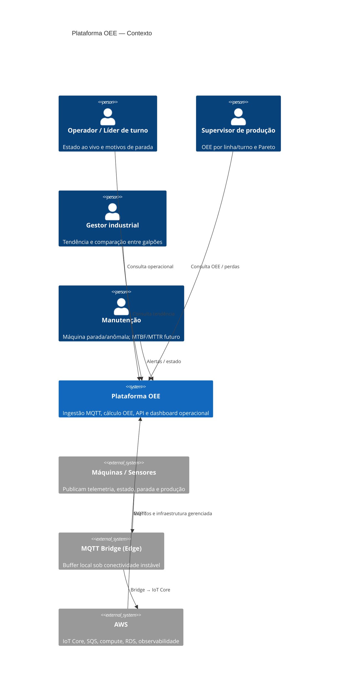
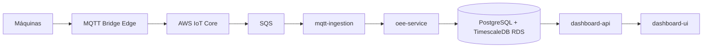

# Arquitetura — Plataforma OEE (Malharia Contínua)

## 1. Objetivos

Este repositório responde ao desafio de base arquitetural para **ingestão IoT (MQTT)** e **dashboard operacional de OEE** em indústria têxtil. O objetivo não é entregar um produto completo, e sim demonstrar decisões explícitas, contratos versionados e um núcleo de regras de negócio verificável.

**No escopo do MVP**
- Microsserviços lógicos documentados (C4 + ADRs).
- Contratos MQTT (JSON Schema) e API (`openapi.yaml`).
- Núcleo executável de cálculo de OEE (`oee-service`) com testes.
- Wireframe do dashboard (`docs/wireframe` + `dashboard-ui`).
- Pipeline de CI com quality gates.

**Fora do MVP (consciente)**
- Broker MQTT real e runtime completo dos quatro serviços.
- Deploy automático na AWS.
- UI implementada (além do wireframe).
- Diagrama C4 de Componentes (além de Contexto e Contêiner).

Esses cortes existem porque o enunciado prioriza profundidade de raciocínio sobre volume de código; o tempo foi investido em modelagem, contratos e corretude do OEE.

## 2. Estilo arquitetural

A solução adota arquitetura **event-driven** com **microsserviços lógicos**: cada bounded context tem responsabilidade única, contratos próprios e unidade de deploy prevista na AWS, mas o MVP implementa de fato apenas o núcleo de domínio (`oee-service`) mais artefatos de contrato e wireframe.

**Por que neste desafio:** a especificação exige endereçar QoS, idempotência, backpressure, schema versionado e OEE auditável sem obrigar um pipeline industrial completo. Microsserviços lógicos permitem pontuar limites de serviço, fluxo assíncrono e evolução independente sem o custo de vários runtimes neste prazo. Detalhes e alternativas: [ADR-001](./adr/001-microsservicos-logicos.md), [TRADEOFFS.md](./TRADEOFFS.md).

## 3. Princípios arquiteturais

| Princípio | Como se aplica neste projeto |
|-----------|------------------------------|
| Responsabilidade única por serviço | Ingestão, cálculo OEE, API de leitura e UI não compartilham o mesmo módulo de escrita. |
| Contratos como fonte de integração | Serviços se acoplam via JSON Schema MQTT e OpenAPI, não via código ou banco compartilhado de escrita. |
| Event-driven | Telemetria e eventos de chão fluem de forma assíncrona; o OEE reage a eventos (incl. late events). |
| Managed services quando agregam valor | No desenho AWS, IoT Core, SQS e observabilidade gerenciada absorvem escala e operação; dados de leitura ficam em Postgres/Timescale por portabilidade. |
| Baixo acoplamento | Buffer na borda e fila interna desacoplam chão de fábrica do cálculo e da API. |
| MVP orientado à arquitetura | Código mínimo no que a banca precisa ver executável (OEE + validação de contratos); o restante é especificado para evolução. |

## 4. Bounded contexts / serviços

| Serviço | Responsabilidade | Dono de contrato / dado | Por que existe neste desafio | MVP |
|---------|------------------|-------------------------|------------------------------|-----|
| `mqtt-ingestion` | Validar schema, deduplicar (`event_id`), DLQ, publicar evento interno | Consome `packages/mqtt-contracts` | Isola resiliência MQTT (ordem, duplicata, inválidos) do cálculo de OEE | Documentação + schemas |
| `oee-service` | Disponibilidade, Performance, Qualidade, OEE; janelas; recompute | Agregações máquina/turno | É a fonte da verdade do indicador central do desafio | **Código + Vitest** |
| `dashboard-api` | Leitura para backoffice (OEE, Pareto, série, estado ao vivo) | `openapi.yaml` | Desacopla UI do domínio; permite wireframe consumir contrato real | **OpenAPI** |
| `dashboard-ui` | Experiência das personas (operador → gestor) | [Wireframe](./wireframe/dashboard.md) | Responde às perguntas do dashboard sem gastar o prazo em pixels | **Wireframe** |

Contratos MQTT compartilhados ficam em `packages/mqtt-contracts` para versionar schemas uma vez e evitar duplicação entre ingestão e testes — acoplamento só por contrato.

## 5. C4 — Contexto



> Se o renderer não suportar C4, o mesmo conteúdo é representado pelo diagrama de contêineres na seção seguinte e pelos fluxos em [docs/wireframe](./wireframe/).

## 6. C4 — Contêiner



Cada contêiner mapeia a um serviço lógico e a uma unidade de deploy futura na AWS. No MVP, apenas `oee-service` (regras) e os contratos da `dashboard-api` / MQTT são materializados em artefatos versionados.

## 7. Fluxo de processamento

1. Publicação nos tópicos `fabrica/{galpao}/{linha}/{maquina}/{telemetria|estado|parada|producao}` com QoS 0 (telemetria) e QoS 1 (estado, parada, produção).
2. Buffer no MQTT Bridge na borda — o cenário de chão prevê atraso, duplicata e perda de link.
3. AWS IoT Core → SQS (backpressure entre broker e consumidores).
4. `mqtt-ingestion`: valida JSON Schema, deduplica por `event_id` (fallback composto), envia inválidos à DLQ, emite evento interno.
5. `oee-service`: aplica D×P×Q, clamp `[0,1]`, sinaliza `dados_inconsistentes`; late events **reabrem e recalculam** a janela.
6. Persistência de agregações (máquina × turno) em PostgreSQL + TimescaleDB.
7. `dashboard-api` expõe leitura; `dashboard-ui` (wireframe) consome o contrato.

**Por que este fluxo:** cobre os requisitos de mensageria e OEE da especificação técnica sem exigir broker real no repositório do candidato.

## 8. Contratos

| Tipo | Local | Versionamento |
|------|-------|----------------|
| MQTT | `packages/mqtt-contracts` | `schema: *.v1` + `event_id` |
| HTTP | `services/dashboard-api/openapi.yaml` | SemVer em `info.version` |

Contratos evoluem de forma compatível; breaking changes exigem nova versão maior. Isso atende o requisito de schema versionado e dead-letter sem acoplar UI ao cálculo.

## 9. Arquitetura AWS

```text
Máquinas → MQTT Bridge (Edge) → IoT Core → SQS
  → mqtt-ingestion → oee-service → RDS (PostgreSQL + TimescaleDB)
  → dashboard-api → dashboard-ui
```

- **Observabilidade:** CloudWatch Logs/Metrics + X-Ray (lag de ingestão, DLQ, recompute de janela).
- **Deploy (futuro, só documentado):** GitHub Actions → OIDC → ECR → ECS/Lambda.
- **Por AWS neste desafio:** ecossistema maduro para IoT e event-driven, com serviços gerenciados no caminho quente.
- **Por Postgres+Timescale (não Timestream):** consultas de negócio + time-series com menor lock-in e conhecimento difundido.
- **Por bridge na borda:** conectividade instável do enunciado.

## 10. OEE (resumo)

```
Disponibilidade = Tempo Rodando / Tempo Planejado
Performance     = (Ciclo Ideal × Total Produzido) / Tempo Rodando
Qualidade       = Peças Boas / Total Produzido
OEE             = Disponibilidade × Performance × Qualidade
```

- Paradas planejadas reduzem tempo planejado; não planejadas reduzem tempo rodando.
- Fatores em `[0,1]`; inconsistências não são mascaradas (`dados_inconsistentes`).
- Granularidade da API: **máquina + turno**; linha/galpão são agregações derivadas.
- **Por que produto e não média:** é a definição do desafio e a base de credibilidade do indicador no chão (cenário de mentoria).

Implementação e testes: `services/oee-service`.

## 11. Qualidade e CI

Pipeline (GitHub Actions) com stages: install → `tsc` → ESLint → Vitest (coverage ≥ 85%) → JSON Schema → Redocly → Sonar **se** `SONAR_TOKEN` (S1) → upload de artefatos.

**Por que gates rígidos neste desafio:** o eixo de harness exige evidência executável; o núcleo é pequeno o bastante para coverage alto ser realista. Uso de IA e contexto: [AI_ASSISTED.md](./AI_ASSISTED.md), [`AGENTS.md`](../AGENTS.md).

## 12. Mapa do repositório

```text
packages/mqtt-contracts/     # JSON Schemas MQTT
services/mqtt-ingestion/     # borda de ingestão (doc no MVP)
services/oee-service/        # núcleo executável
services/dashboard-api/      # OpenAPI
services/dashboard-ui/       # aponta ao wireframe
docs/wireframe/              # Mermaid + Markdown
docs/adr/                    # decisões relevantes
```

A árvore existe para espelhar os contêineres C4 e orientar implementação futura sem reorganizar o repo.

## 13. TODOs conscientes

| Item | Por que ficou de fora |
|------|------------------------|
| Runtime dos quatro serviços + `docker-compose` | MVP prioriza contratos e OEE; multi-serviço rodando aumenta glue sem novo argumento arquitetural |
| Broker real / IoT Core provisionado | Enunciado dispensa; fixtures + schemas bastam para contratos |
| Deploy OIDC/ECS automatizado | Design de CI/CD e nuvem já pontua; automação exige conta/secrets além do fork |
| UI React completa | Wireframe + OpenAPI atendem opção B da especificação |
| C4 Componentes / MTBF-MTTR | Evolução natural após o núcleo estável |

## 14. Considerações finais

Esta arquitetura prioriza separação de responsabilidades, contratos bem definidos e qualidade da entrega alinhados ao que o desafio avalia. O MVP concentra implementação nas regras de OEE e na validação de contratos MQTT/OpenAPI, preservando um desenho preparado para evolução na AWS sem aumentar desnecessariamente a complexidade da solução neste prazo.
