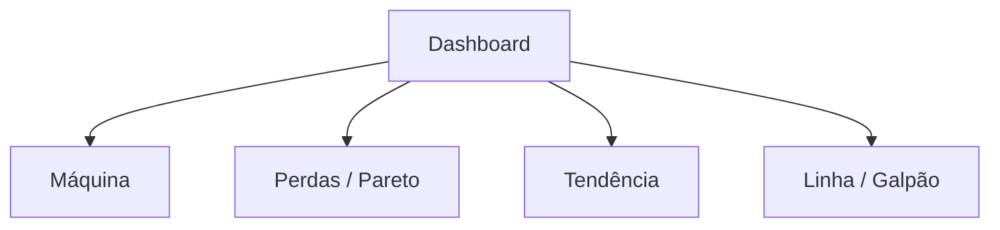

# Wireframe — Dashboard operacional de OEE

Artefato do MVP (não é UI implementada). Representa a experiência das personas e o vínculo com a `dashboard-api`. Referenciado por [ARQUITETURA.md](../ARQUITETURA.md); o serviço lógico correspondente é `services/dashboard-ui`.

## Objetivo

Responder às perguntas do contexto de negócio — OEE atual e fatores, maiores perdas, Pareto de paradas, evolução temporal e máquina parada/anômala — sem comprometer o prazo com pixels. A granularidade de domínio da API permanece **máquina + turno**; linha/galpão aparecem como agregações derivadas.

## Personas × telas

| Persona | Telas principais |
|---------|------------------|
| Operador / Líder de turno | Máquina (estado ao vivo, OEE, fatores) |
| Supervisor de produção | Perdas / Pareto; Máquina |
| Gestor industrial | Tendência; Linha/Galpão (agregado) |
| Manutenção | Máquina (parada/anômala); Perdas |

## Navegação



## Atualização em tempo quase real

O dashboard foi modelado de forma **desacoplada do mecanismo de atualização**. A API permite evolução para SSE, WebSocket ou polling conforme frequência, bidirecionalidade e infraestrutura. Para o escopo deste MVP, o mecanismo de push permanece como **decisão de implementação futura** — o wireframe e o contrato HTTP já descrevem o que a UI precisa consumir.

---

## Tela 1 — Máquina (visão operacional)

**Perguntas:** Qual o OEE atual? A máquina está parada/anômala agora? Onde está a perda (D, P ou Q)?

```text
+----------------------------------------------+
| Máquina TEAR-G1-L2-07          OEE  82,4%    |
| Turno: T2  |  Estado: PARADO  |  ! inconsist. |
+----------------------------------------------+
|  D 87,5%   |   P 95,2%   |   Q 95,0%         |
+----------------------------------------------+
| Motivo atual: QBR_AGULHA (não planejada)     |
+----------------------------------------------+
| [sparkline OEE do turno]                     |
+----------------------------------------------+
```

**Contratos (OpenAPI):**
- `GET /machines/{machineId}/oee?shift={shiftId}`
- `GET /machines/{machineId}/status`

---

## Tela 2 — Perdas / Pareto

**Pergunta:** Quais os principais motivos de parada no período?

```text
+----------------------------------------------+
| Perdas — TEAR-G1-L2-07  |  Turno T2          |
+----------------------------------------------+
| Pareto motivos                               |
| ████████████  QBR_AGULHA                     |
| ████████      QBR_FIO                        |
| ████          FALTA_MAT                      |
| ██            AJUSTE_QUAL                    |
+----------------------------------------------+
| Planejada vs não planejada (resumo)          |
+----------------------------------------------+
```

**Contratos:**
- `GET /machines/{machineId}/losses?shift={shiftId}`

---

## Tela 3 — Tendência

**Pergunta:** Como o OEE evoluiu ao longo do dia/semana/mês?

```text
+----------------------------------------------+
| Tendência OEE — TEAR-G1-L2-07                |
| Período: [turno] [dia] [semana]              |
+----------------------------------------------+
|                                              |
|   OEE %                                      |
|    |     /\                                  |
|    |    /  \/\                               |
|    |___/      \___                           |
|         tempo / turnos                       |
+----------------------------------------------+
| Pontos com dados_inconsistentes destacados   |
+----------------------------------------------+
```

**Contratos:**
- `GET /machines/{machineId}/timeline?from=&to=`

---

## Tela 4 — Linha / Galpão (agregação derivada)

**Pergunta:** Comparação entre linhas/galpões (visão do gestor).

```text
+----------------------------------------------+
| Galpão G1 / Linha L2                         |
+----------------------------------------------+
| OEE agregado (derivado das máquinas)  79,1%  |
+----------------------------------------------+
| Ranking máquinas                             |
| 1. TEAR-...-07   82,4%                       |
| 2. TEAR-...-08   76,0%                       |
| 3. ...                                       |
+----------------------------------------------+
```

**Contratos:**
- `GET /lines/{lineId}/summary?shift={shiftId}`
- `GET /sites/{siteId}/summary?shift={shiftId}` *(galpão; evolução futura)*

> Estes endpoints agregam leituras já calculadas em máquina/turno; não alteram o núcleo de domínio do `oee-service`.

---

## Coerência com a arquitetura

| Artefato | Papel |
|----------|--------|
| Este wireframe | Experiência e perguntas de negócio |
| `services/dashboard-api/openapi.yaml` | Contrato HTTP das telas acima |
| `services/dashboard-ui` | Serviço lógico da UI (README aponta para cá) |
| `oee-service` | Fonte da verdade de D × P × Q |

TODOs conscientes: implementação visual, autenticação e escolha do mecanismo de atualização em tempo quase real.
